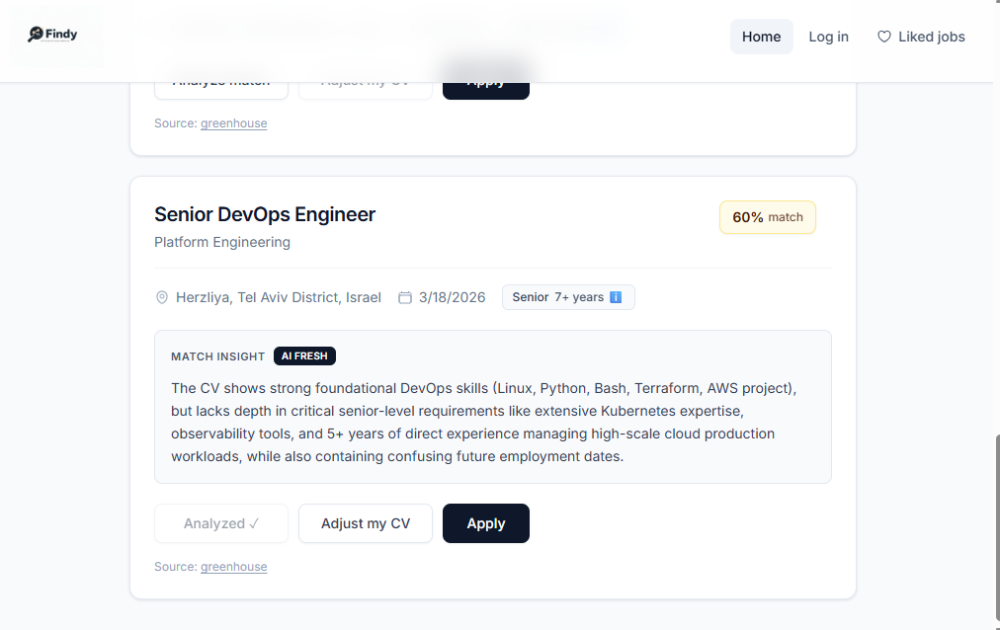
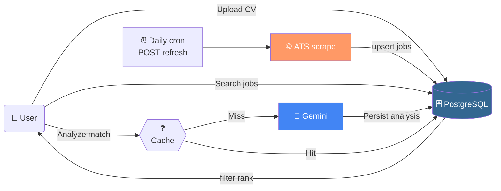
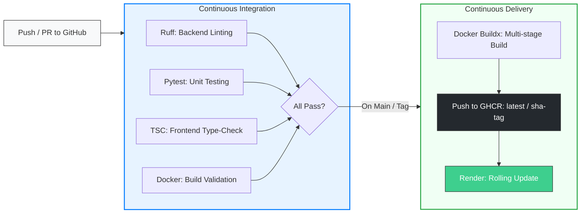

# 🚀 AI-Powered Career Matcher

**[Live Demo 🌐](YOUR_RAILWAY_URL_HERE)**

Full-stack app that aggregates **Israel-focused tech roles** from multiple ATS sources, scores **CV ↔ job fit** with **Gemini**, and persists **analyzed matches** in **PostgreSQL** (e.g. `job_match_analyses` by CV hash + job URL). **Job search** reads **`public.jobs` in Supabase** (no live scrape on each search). Listings are filled by **`POST /api/jobs/refresh`** — run it manually once, then schedule a **daily cron** (see below) to rescrape and upsert.

## Screenshot

Job board with **AI match insight**, score, and actions (**Analyze Match**, **Adjust My CV**, **Apply**):



## Tech Stack

- **Frontend:** React 18, TypeScript, Vite, Tailwind CSS.
- **Backend:** Python Flask, Gunicorn.
- **Database:** PostgreSQL.
- **AI:** Gemini 2.5 Flash API.

## Features

- **Aggregates job postings from multiple ATS platforms**
  - Greenhouse
  - Lever
  - Workday
  - Comeet

- **Job filtering**
  - Title filtering
  - Seniority detection
  - Israel-based opportunities

 **AI-Driven Match Intelligence**
  - **Semantic Ranking:** Beyond keyword matching—uses **Gemini 2.5 Flash** to understand context and experience alignment.
  - **Actionable Insights:** Generates a "Fit Score" (0-100) and specific "Adjust My CV" tips for each position.
  - **Read-Through Caching:** Engineered a logic that prioritizes PostgreSQL lookups over AI API calls to minimize latency and operational costs.
  - **Structured Data:** LLM-powered extraction that converts unstructured job descriptions into a normalized JSON format.

## System Architecture



### Database and job data

- Apply `postgresql/schema.sql` (or incremental files under `postgresql/migrations/`) in the Supabase SQL editor.
- **`public.jobs`**: populated by the backend **`POST /api/jobs/refresh`** (scrape + upsert). **Search** only reads from here via Flask; if the table is empty, search returns no listings until refresh succeeds.
- **`job_match_analyses`**: Gemini results keyed by **`cv_content_hash` + `job_url`**, optional `resume_id`, **`job_snapshot`**. See migration `004_job_match_analyses.sql`.
- Legacy **`match_history`** (resume UUID + `jobs.id`) is still used when **`supabase_job_id`** is present on a card.

### Daily scrape (cron)

Schedule an HTTP call to refresh listings (adjust host and secret):

```bash
# Example: 06:00 UTC daily; requires JOBS_REFRESH_SECRET in .env when set on the server
0 6 * * * curl -fsS -X POST "https://your-host/api/jobs/refresh" -H "Authorization: Bearer $JOBS_REFRESH_SECRET"
```

If **`JOBS_REFRESH_SECRET`** is **unset**, refresh is open (fine for local dev). If **set**, requests must send the same value as **`Authorization: Bearer <secret>`** or **`?token=<secret>`**.

**Local:** `curl -X POST http://localhost:5000/api/jobs/refresh`

## CI/CD

End-to-end flow is **Docker-first**: GitHub Actions validates every change; **GitHub Container Registry (GHCR)** stores **immutable, versioned images**; **Render** runs production using a **push-to-deploy** model with **rolling updates** for zero-downtime cutovers.




### 🧪 CI — Continuous Integration (`.github/workflows/ci.yml`)

Triggered on **every push** and **pull request** across all branches to ensure stability:


| Stage | Path / Context | Tool & Command |
| :--- | :--- | :--- |
| **Lint** | `backend/` | **Ruff** (Static analysis & formatting) |
| **Test** | `tests/` | **Pytest** (Unit & Integration tests) |
| **Type-check** | `frontend/src/` | **TypeScript** (`tsc --noEmit`) |
| **Frontend build** | `frontend/` | **Vite** production build verification |
| **Docker** | `./Dockerfile` | **Buildx** multi-stage validation |

### 🚀 CD — Continuous Delivery (`.github/workflows/cd.yml`)

Triggered only on **pushes to `main`** or **Git tags** (`v*`):


| Step | Action | Description |
| :--- | :--- | :--- |
| **Build & Push** | `Dockerfile` | Multi-stage production build pushed to **GHCR** |
| **Versioning** | `ghcr.io/` | Tags: **`latest`**, **`sha-<commit>`**, and **SemVer tags** |
| **Deploy** | **Render Hook** | Triggers an automated **Zero-Downtime Rolling Update** |


---

